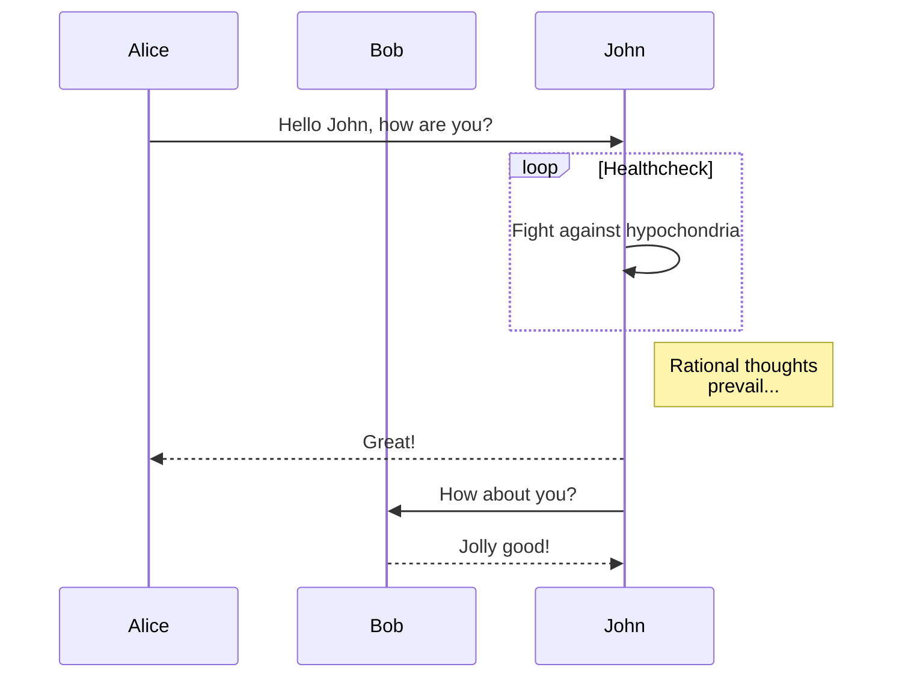
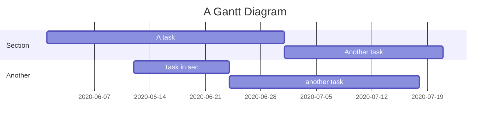
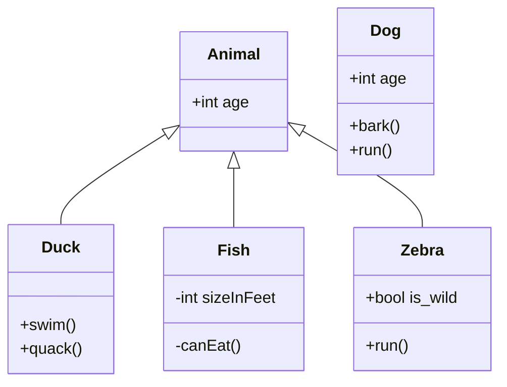
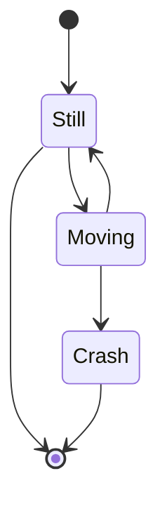
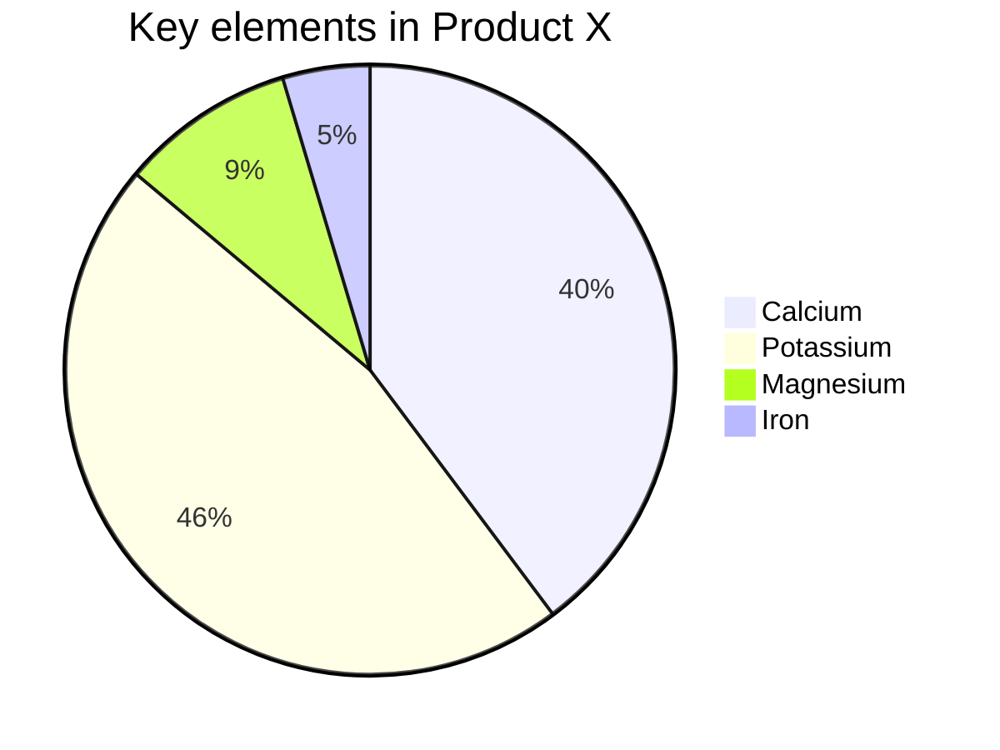
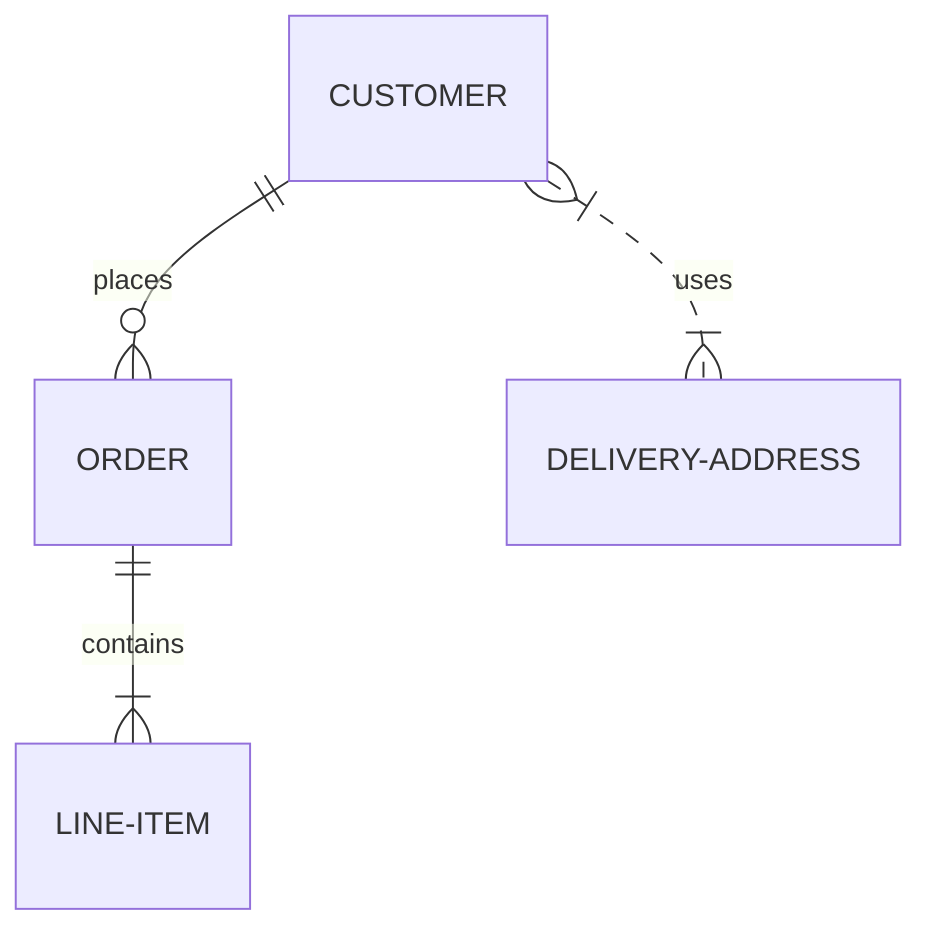
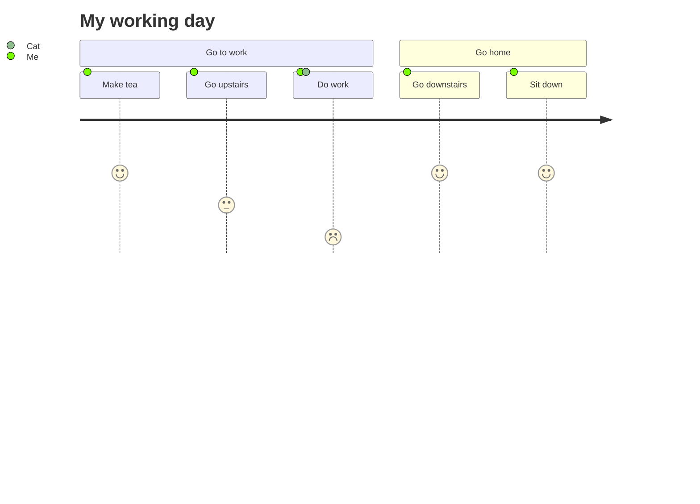
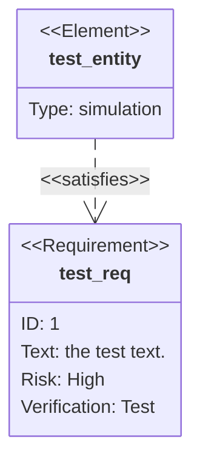

# Intro mermaid

[Main site](https://mermaid-js.github.io/mermaid/)

[Documentation](https://mermaid-js.github.io/mermaid/#/)

[Live editor](https://mermaid-js.github.io/mermaid-live-editor/)

[Chart examples](https://mermaid-js.github.io/mermaid/#/flowchart)

## Mermaid in markdown

### Flowchart

### Sequence diagram

### Gantt diagram

### Class diagram

### State diagram

### Pie chart

### ER diagram

### User journey

### Entity relationship diagram

### Requirement diagram

